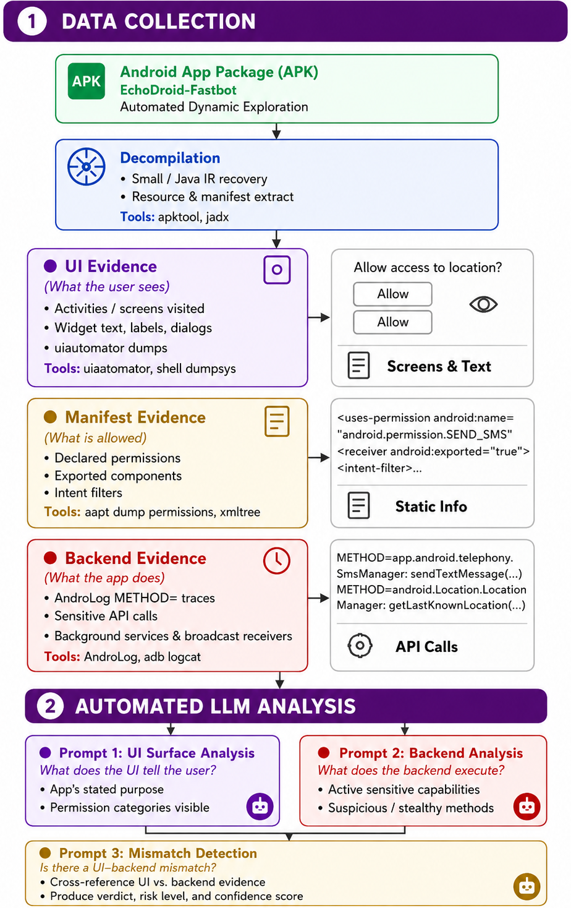
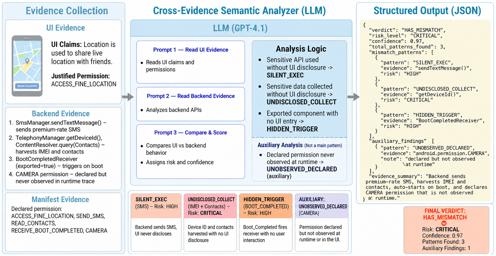

# EchoDroid: Detecting UI–Backend Permission Mismatches in Android Applications

EchoDroid is an LLM-assisted framework for detecting suspicious Android application behavior by identifying inconsistencies between:

- What an application presents to users through its UI
- What it actually executes at runtime
- What permissions it declares in its manifest

The framework combines automated UI exploration, runtime behavior collection, manifest analysis, rule-based reasoning, and large language models to identify potential mismatches, covert data collection, hidden triggers, and other permission misuse patterns. The design is motivated by the observation that malicious or privacy-invasive applications often perform sensitive operations that are not disclosed through their user interface.

## Overview

EchoDroid automatically explores Android applications using Fastbot/Monkey, collects runtime evidence through instrumentation and dynamic tracing, extracts UI content using UIAutomator, and analyzes Android manifests.



The collected evidence is then processed through a three-stage reasoning pipeline:



## Key Features

### UI–Backend Mismatch Detection

Detects situations where:

* The UI does not disclose a capability
* The backend performs sensitive actions anyway

Examples:

* Accessing device identifiers without disclosure
* Reading location in the background
* Sending SMS messages without visible functionality
* Hidden broadcast-triggered behaviors

### Multi-Source Evidence Correlation

EchoDroid correlates:

* UI content
* Runtime execution traces
* Android manifest declarations

instead of relying on only static or dynamic analysis.

### LLM-Assisted Reasoning

The framework uses a three-stage reasoning pipeline:

1. UI Surface Analysis
2. Backend Execution Analysis
3. Permission Mismatch Detection

to produce human-readable explanations and verdicts.  

### Hidden Trigger Detection

Supports malware families that activate functionality only after:

* BOOT_COMPLETED
* PACKAGE_ADDED
* CONNECTIVITY_CHANGE
* Other broadcast events

through automated trigger injection.  

### Runtime Instrumentation Support

Supports:

* AndroLog-based instrumentation
* Frida runtime tracing
* Fastbot exploration
* Monkey fallback execution

for collecting runtime evidence from Android applications.


## Detected Mismatch Patterns
| Pattern | Description | Risk |
|----------|-------------|------|
| `SILENT_EXEC` | Sensitive backend execution not disclosed in the UI | High |
| `UNDISCLOSED_COLLECTION` | Silent collection of device identifiers, location, SMS, or other sensitive data without user disclosure | Critical |
| `HIDDEN_TRIGGER` | Sensitive functionality activated through hidden triggers that are not reachable through normal UI interaction | High |
| `UNOBSERVED_DECLARED` | Permissions declared in the manifest but not reflected in observed UI behavior or runtime usage | Medium |

## Repository Structure
```text
EchoDroid/
│
├── LEchoDroid/
│   ├── Prompt_MismatchDetection.py
│   ├── run_mismatch_detection.sh
│   ├── Hidden_trigger_run.sh
│   ├── monkey/
│   ├── native/
│   ├── libs/
│   ├── data/
│   └── config_mismatch_template.json
│
├── tools/
│   ├── AndroLog/
│   ├── androlog_pipeline/
│   ├── frida/
│   ├── smali_injector/
│   └── pipeline/
│
├── sample_tested_apks/
├── sample_instrumented_tested_apks/
├── sample_output/
└── README.md
```

## Mismatch Detection Pipeline

### Stage 1: UI Analysis

Collected using:

* UIAutomator dumps
* Activity coverage logs
* Widget text extraction

Outputs:

* UI capabilities
* Sensitive features disclosed to users
* Categories absent from the UI

### Stage 2: Runtime Analysis

Collected using:

* AndroLog instrumentation
* Frida tracing
* Logcat monitoring

Outputs:

* Executed methods
* Sensitive API invocations
* Backend capability categories

### Stage 3: Mismatch Detection

Cross-references:

* UI evidence
* Runtime evidence
* Manifest declarations

Outputs:

* Verdict
* Risk level
* Confidence score
* Detected mismatch patterns


## Required Components

| Component | Purpose |
|------------|---------|
| Fastbot | Automated UI exploration |
| AndroLog | Runtime method instrumentation and logging |
| apktool | APK decoding and rebuilding |
| ADB | Device communication and automation |
| AAPT | Manifest and permission extraction |
| Python 3.10+ | LLM analysis pipeline |
| OpenAI SDK | Prompt execution |
| Java 17+ | AndroLog and Android tooling |
| Android SDK | Emulator and build tools |


## Quick Start

### Step 1: Instrument the APK

EchoDroid requires runtime method traces generated by AndroLog. First instrument the target APK:

```bash
cd tools/androlog_pipeline

./instrument_apk_with_androlog.sh \
    /path/to/app.apk \
    /path/to/output_directory \
    APP_LOG_TAG
```

Example:
```bash
cd tools/androlog_pipeline

./instrument_apk_with_androlog.sh \
    suspicious_apks/sample.apk \
    suspicious_apks/sample_androlog_instr \
    SAMPLE_APP_LOG
```

### Step 2: Run EchoDroid

Analyze the instrumented APK using the main detection pipeline:
```bash
cd EchoDroid
./run_mismatch_detection.sh \
    /path/to/instrumented.apk \
    "AppName" \
    300
```
Example:
```bash
./run_mismatch_detection.sh \
    suspicious_apks/sample_androlog_instr/base.apk \
    "SampleApp" \
    300
```
The third parameter specifies the exploration duration in seconds. We recommend at least 300 seconds for meaningful UI coverage.

## Output

### Main Detection Result

The primary output of EchoDroid is:

```text
mismatch_analysis/mismatch_detection_report.json
```

This report summarizes the complete analysis and contains:

- Final detection verdict
- Risk assessment
- Confidence score
- Detected mismatch patterns
- Runtime evidence
- UI evidence
- Manifest evidence
- LLM reasoning results
- Rule-based analysis results

### Collected Evidence

EchoDroid gathers evidence from three complementary sources before performing mismatch analysis.

#### Runtime Evidence

Runtime behavior is collected during automated exploration using Fastbot, hidden-trigger execution, AndroLog instrumentation, and optional Frida monitoring.

Generated files:

```text
androlog_methods.txt
frida_methods.txt
logcat_with_methods.log
console.txt
mismatch_pipeline.log
```

These artifacts may contain:

- Sensitive API invocations
- Dynamic method execution traces
- Activity launches and transitions
- Hidden-trigger activation events
- Android system log messages
- Permission-related runtime behavior
- Exploration statistics and execution progress

Example runtime traces:

```text
at.itagents.ta.StartSetupActivity:
    void onCreate(android.os.Bundle)

com.airpush.android.SetPreferences$MyLocationListener:
    void onProviderEnabled(java.lang.String)

com.airpush.android.SetPreferences$MyLocationListener:
    void onProviderDisabled(java.lang.String)
```

Example system logs:

```text
CameraManagerGlobal:
    Connecting to camera service

WifiService:
    SecurityException:
    UID has no location permission
```

#### UI Evidence

User-interface information is extracted using UIAutomator during application exploration.

Generated file:

```text
ui_widget_text.txt
```

This evidence includes:

- Visible screen text
- Widget labels and descriptions
- Activity content
- User-facing functionality descriptions
- Permission disclosures presented to users

The UI evidence is used to infer the application's apparent functionality and privacy expectations.

#### Manifest Evidence

Manifest analysis extracts security-relevant metadata directly from the APK.

Collected information includes:

- Requested permissions
- Exported activities
- Exported services
- Broadcast receivers
- Content providers
- Application metadata

This information is combined with runtime and UI evidence to identify inconsistencies between declared capabilities and observed behavior.

#### LLM Reasoning Outputs

EchoDroid performs analysis using a three-stage reasoning pipeline.

Generated files:

```text
prompt1_ui_analysis.json
prompt2_backend_analysis.json
prompt3_mismatch_detection.json
```

### Example Verdict

```json
{
  "verdict": "SUSPICIOUS",
  "risk_level": "medium",
  "confidence": 0.70,
  "total_patterns_found": 4
}
```

Possible verdicts:

| Verdict | Meaning |
|----------|----------|
| HAS_MISMATCH | Strong evidence of hidden or suspicious behavior |
| SUSPICIOUS | Mismatch signals detected; manual review recommended |
| LIKELY_CLEAN | No significant mismatches observed |
| INSUFFICIENT_DATA | Exploration coverage was insufficient |

### Typical Output Structure

```text
sample_output/
└── Mismatch_<app_name>/
    ├── config.json
    ├── console.txt
    ├── ui_widget_text.txt
    ├── androlog_methods.txt
    ├── frida_methods.txt
    ├── logcat_with_methods.log
    ├── mismatch_pipeline.log
    │
    └── mismatch_analysis/
        ├── mismatch_detection_report.json
        ├── prompt1_ui_analysis.json
        ├── prompt2_backend_analysis.json
        └── prompt3_mismatch_detection.json
```

## Results

We evaluated EchoDroid using VirusTotal labels as ground truth. Apps flagged by 9 or more VirusTotal engines were treated as malicious, while apps flagged by fewer than 9 engines were treated as benign.

**Dataset Comparison**

| Dataset | Precision | Recall | F1 | Balance | Threshold | Status |
|----------|----------:|--------:|--------:|----------|----------|----------|
| 215 apps | 97.01% | 92.91% | 86.75% | 66/34% | Tuned | Imbalanced |
| 421 apps | 98.45% | 63.05% | 76.65% | 51/49% | Tuned | Low Recall |
| 390 apps | 89.95% | 88.54% | 89.24% | 50/50% | Fixed 0.5 | Best Overall |

**Final Results (390 Apps)**

| Metric | Result |
|----------|----------:|
| Total Apps | 390 |
| VT Benign | 198 |
| VT Malicious | 192 |
| Accuracy | 89.49% |
| Precision | 89.95% |
| Recall | 88.54% |
| F1 Score | 89.24% |
| ROC-AUC | 0.974 |
| PR-AUC | 0.987 |

**Confusion Matrix**

|  | Predicted Benign | Predicted Malicious | Total |
|---|---:|---:|---:|
| Actual Benign | 179 TN | 19 FP | 198 |
| Actual Malicious | 22 FN | 170 TP | 192 |
| **Total** | **201** | **189** | **390** |


**Model Features**

The best-performing classifier uses confidence-scaled LLM signals:

```text
verdict_weighted = verdict_score × confidence
risk_weighted    = risk_score × confidence
conf_score       = confidence
```

| Feature | Formula | Range |
|----------|----------|----------|
| `verdict_weighted` | `verdict_score × confidence` | 0.00–2.85 |
| `risk_weighted` | `risk_score × confidence` | 0.00–3.80 |
| `conf_score` | Raw confidence | 0.30–1.00 |

**Classifier:** Logistic Regression (`class_weight=balanced`)  
**Validation:** 5-Fold Stratified Cross-Validation  
**Decision Threshold:** Fixed at `0.5`

## Research Motivation

EchoDroid is designed around the following hypothesis:

> Android applications exhibiting significant discrepancies between UI-disclosed functionality and backend runtime behavior may contain hidden, malicious, or privacy-invasive functionality.

> The framework provides a practical way to operationalize and evaluate this hypothesis through automated evidence collection and LLM-assisted reasoning.  


## Current Limitations

* Dynamic exploration coverage is inherently incomplete.
* Login-protected functionality may not be reached.
* Some commercial applications employ anti-instrumentation protections.
* Frida tracing may be blocked by integrity checks.
* LLM outputs are probabilistic and may vary slightly across runs.
* Hidden behaviors requiring server-side activation may remain undiscovered.

## License
See the LICENSE file for licensing information.